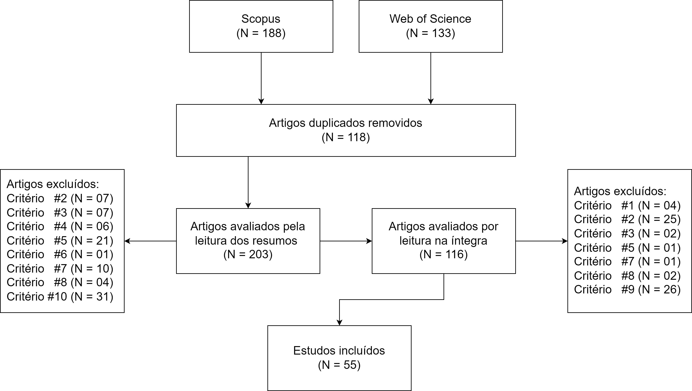

# Patterns in Game Design for Inquiry-Based Learning

## Abstract

Inquiry-Based Learning (IBL) is a social constructivist approach that engages students in constructing knowledge based on evidence and in reproducing, as far as possible, the epistemic practices of the domain through the investigation of realistic problems. Digital games are potentially aligned with IBL, since they enable active, situated, authentic, and collaborative learning in safe environments capable of simulating complex scenarios. However, designing digital educational games (DEGs) compatible with IBL requires aligning ludic and pedagogical goals, ensuring that player actions lead to the construction of conceptual, procedural, and metacognitive knowledge. This alignment demands calibrating appropriate challenges, integrating scaffolds into the gameplay, and weaving mechanics, missions, and narrative into a cohesive and intellectually stimulating experience. The resulting technical and pedagogical complexity entails greater planning, time, and effort from educators compared with traditional approaches. Moreover, developing such games typically involves multidisciplinary teams, which can give rise to communication breakdowns. Game design patterns offer a common language and a repository of solutions to help mitigate these obstacles. Accordingly, this study aims to create a catalog of design patterns for DEGs aligned with IBL.

## Files

- `IBL-Articles-Descriptions.csv` is a dataset which contains the answers to the 16 questions made in the research for each selected article.
- `IBL-Thematic_Analysis.csv` is a dataset which contains the thematic analysis for each IBL phase of each selected article.
- `cluster_analysis.ipynb` is a Jupyter Notebook which performs clustering (HC-Gower, HC-Hamming, and LCA) on the `IBL-Articles-Descriptions.csv` dataset, choosing k that maximizes Silhouette + Davies–Bouldin, and visualizes clusters with MDS.
- `articles.zip` contains all selected articles.

## Selected Articles

Exclusion criteria:

1. The article does not present an empirical study;
2. The article does not detail the implementation of IBL;
3. It involves virtual reality;
4. It focuses on early childhood education (Preschool Education);
5. It focuses on attitudinal, formative, or interpretative aspects of teachers;
6. The target audience is neurodivergent students or students with disabilities;
7. It conducts a systematic review or meta-analysis;
8. The article is not related to formal education;
9. It does not describe IBL as defined in this dissertation. For example, the approach does not employ collaborative learning (students do not gather in groups, nor are discussion sessions explicitly part of the process), or the study describes an experiment whose level of inquiry is “confirmatory investigation”;
10. Article not available for download.

PRISMA:

Selected articles with IDs:

|        |             |                                                                                                                                                                                                                                                                                                                                              |
| ------ | ----------- | -------------------------------------------------------------------------------------------------------------------------------------------------------------------------------------------------------------------------------------------------------------------------------------------------------------------------------------------- |
| **ID** | **Cluster** | **Artigo**                                                                                                                                                                                                                                                                                                                                   |
| 2      | 3           | Premthaisong, S., & Srisawasdi, N. (2024). An effect of technology-infused active inquiry learning in primary school science on students’ conceptions of learning science. EURASIA Journal of Mathematics, Science and Technology Education, 20(6), em2463. https://doi.org/10.29333/ejmste/1466                                             |
| 5      | 1           | Cheng, M.-T., et al. (2024). Blending educational gaming with physical experiments to engage high school students in inquiry-based learning. Journal of Biological Education, 58(5), 1517–1536. https://doi.org/10.1080/00219266.2022.2157861                                                                                                |
| 13     | 2           | Martin, E., et al. (2024). Mobile learning as instruction prompt guidance to support the inquiry-based learning process: An experimental study on primary school students. Review of Science, Mathematics and ICT Education, 18(1), 5–28. https://doi.org/10.26220/rev.4610.                                                                 |
| 17     | 1           | Pandeeswari, T., Chandrasekaran, J., & Pudumalar, S. (2024). Redesigning laboratory courses in information technology program: An inquiry-based learning approach. Journal of Engineering Education Transformations, 37(Special Issue), 921–930. https://doi.org/10.16920/jeet/2024/v37is2/24140                                             |
| 20     | 2           | Bouchée, T., et al. (2024). The design and construction of a PhET-based inquiry learning worksheet to develop understanding of the particle-in-a-box model. Physics Education, 59, 015031. https://doi.org/10.1088/1361-6552/ad11f8                                                                                                          |
| 26     | 1           | Sumarni, W., et al. (2023). Blended inquiry learning with ethno-STEM approach for first-semester students’ chemical literacy. Jurnal Pendidikan IPA Indonesia, 12(3), 439–450. https://doi.org/10.15294/jpii.v12i3.45879                                                                                                                     |
| 27     | 1           | Wang, C., et al. (2021). Comparison of the effects of 1:1 and 1:m CSCL environments with virtual manipulatives for scientific inquiry-based learning: A counterbalanced quasi-experimental study. Interactive Learning Environments. https://doi.org/10.1080/10494820.2021.1948431                                                           |
| 28     | 1           | Sitthikrai, N., Hemtasin, C., & Thongsuk, T. (2023). Development of academic achievements using inquiry-based learning together with educational games. Journal of Education and Learning (EduLearn), 17(3), 441–446. https://doi.org/10.11591/edulearn.v17i3.20859                                                                          |
| 35     | 2           | Siantuba, J., Nkhata, L., & de Jong, T. (2023). The impact of an online inquiry-based learning environment addressing misconceptions on students’ performance. Smart Learning Environments, 10, 22. https://doi.org/10.1186/s40561-023-00236-y                                                                                               |
| 41     | 2           | Lehtinen, A., et al. (2022). Comparing guidance via implicit and explicit model progressions in a collaborative inquiry-based learning environment with different-aged learners. Education Sciences, 12(6), 393. https://doi.org/10.3390/educsci12060393                                                                                     |
| 47     | 2           | Cui, Y., Zhao, G., & Zhang, D. (2022). Improving students’ inquiry learning in web-based environments by providing structure: Does the teacher matter or platform matter? British Journal of Educational Technology, 53, 1049–1068. https://doi.org/10.1111/bjet.13184                                                                       |
| 50     | 3           | Song, Y., et al. (2022). Mapping primary students’ mobile collaborative inquiry-based learning behaviours in science collaborative problem solving via learning analytics. International Journal of Educational Research, 114, 101992. https://doi.org/10.1016/j.ijer.2022.101992                                                            |
| 53     | 2           | Makamu, G., & Ramnarain, U. (2022). Physical sciences teachers’ enactment of simulations in 5E inquiry-based science teaching. Education Sciences, 12(12), 864. https://doi.org/10.3390/educsci12120864.                                                                                                                                     |
| 68     | 3           | Natale, C. C., et al. (2021). Evidence of scientific literacy through hybrid and online biology inquiry-based learning activities. Higher Learning Research Communications, 11, 33–49. https://doi.org/10.18870/hlrc.v11i0.1199.                                                                                                             |
| 69     | 2           | Akaygun, S., & Adadan, E. (2021). Fostering senior primary school students’ understanding of climate change in an inquiry-based learning environment. Education 3–13, 49(3), 330–343. https://doi.org/10.1080/03004279.2020.1854961                                                                                                          |
| 70     | 1           | Dmoshinskaia, N., Gijlers, H., & de Jong, T. (2021). Giving feedback on peers’ concept maps in an inquiry learning context: The effect of providing assessment criteria. Journal of Science Education and Technology, 30, 420–430. https://doi.org/10.1007/s10956-020-09884-y                                                                |
| 73     | 2           | Seibert, J., et al. (2021). Multitouch experiment instructions to promote self-regulation in inquiry-based learning in school laboratories. Journal of Chemical Education, 98(5), 1602–1609. https://doi.org/10.1021/acs.jchemed.0c01177.                                                                                                    |
| 76     | 2           | Gerhátová, Ž., et al. (2021). Temperature measurement—Inquiry-based learning activities for third graders. Education Sciences, 11, 506. https://doi.org/10.3390/educsci11090506                                                                                                                                                              |
| 78     | 3           | Ismailov, M. (2021). Virtual exchanges in an inquiry-based learning environment: Effects on intra-cultural awareness and intercultural communicative competence. Cogent Education, 8(1), 1982601. https://doi.org/10.1080/2331186X.2021.1982601                                                                                              |
| 79     | 3           | Loizou, M., & Lee, K. (2020). A flipped classroom model for inquiry-based learning in primary education context. Research in Learning Technology, 28, 2287. https://doi.org/10.25304/rlt.v28.2287                                                                                                                                            |
| 83     | 3           | Divrik, R., Pilten, P., & Taş, A. M. (2020). Effect of inquiry-based learning method supported by metacognitive strategies on fourth-grade students’ problem-solving and problem-posing skills: A mixed methods research. International Electronic Journal of Elementary Education, 13(2), 287–308. https://doi.org/10.26822/iejee.2021.191. |
| 85     | 2           | Mutlu, A. (2020). Evaluation of students’ scientific process skills through reflective worksheets in the inquiry-based learning environments. Reflective Practice, 21(2), 271–286. https://doi.org/10.1080/14623943.2020.1736999                                                                                                             |
| 89     | 2           | Eppes, T. A., Milanovic, I., & Wright, K. (2020). Improving student readiness for inquiry-based learning: An engineering case study. International Journal of Online and Biomedical Engineering (iJOE), 16(1), 4–17. https://doi.org/10.3991/ijoe.v16i01.12051                                                                               |
| 96     | 2           | Aydin, G. (2020). The effects of guided inquiry-based learning implementations on 4th grades students and elementary teacher: A case study. İlköğretim Online (Elementary Education Online), 19(3), 1155–1184. https://doi.org/10.17051/ilkonline.2020.727298                                                                                |
| 97     | 2           | Sari, U., et al. (2020). The effect of STEM education on scientific process skills and STEM awareness in simulation-based inquiry learning environment. Journal of Turkish Science Education, 17(3), 387–405. https://doi.org/10.36681/tused.2020.34                                                                                         |
| 98     | 2           | Rifai, M., et al. (2020). Using electronic design automation and guided inquiry learning model in higher engineering education. Universal Journal of Educational Research, 8(7), 2946–2953. https://doi.org/10.13189/ujer.2020.080723                                                                                                        |
| 100    | 1           | Becker, S., et al. (2020). Using mobile devices to enhance inquiry-based learning processes. Learning and Instruction, 69, 101350. https://doi.org/10.1016/j.learninstruc.2020.101350                                                                                                                                                        |
| 102    | 1           | Thongkoo, K., Panjaburee, P., & Daungcharone, K. (2019). A development of ubiquitous learning support system based on an enhanced inquiry-based learning approach. International Journal of Mobile Learning and Organisation, 13(2), 129–151. https://doi.org/10.1504/IJMLO.2019.098179.                                                     |
| 103    | 1           | Williams, R. T., Pringle, R. M., & Kilgore, K. L. (2019). A practitioner’s inquiry into vocabulary building strategies for native Spanish-speaking ELLs in inquiry-based science. Research in Science Education, 49, 989–1000. https://doi.org/10.1007/s11165-019-9848-6.                                                                    |
| 105    | 1           | Fifolt, M., & Morgan, A. F. (2019). Engaging K-8 students through inquiry-based learning and school farms. Journal of Education for Students Placed at Risk, 1–17. https://doi.org/10.1080/10824669.2018.1545583                                                                                                                             |
| 106    | 1           | Zarmati, L., & Frappell, A. (2019). Engaging students in inquiry learning at The Big Dig, Sydney. Archaeologies, 15(1), 126–143. https://doi.org/10.1007/s11759-019-09363-w                                                                                                                                                                  |
| 117    | 3           | Laksana, D. N. L., et al. (2019). The effects of inquiry-based learning and learning styles on primary school students’ conceptual understanding in multimedia learning environment. Journal of Baltic Science Education, 18(1), 51–62. https://doi.org/10.33225/jbse/19.18.51                                                               |
| 124    | 1           | Önder, F., Şenyiğit, Ç., & Silay, İ. (2018). Effect of an inquiry-based learning method on students’ misconceptions about charging of conducting and insulating bodies. European Journal of Physics, 39, 055702. https://doi.org/10.1088/1361-6404/aac52a                                                                                    |
| 126    | 2           | Tan, E. (2018). Effects of two differently sequenced classroom scripts on common ground in collaborative inquiry learning. Instructional Science, 46, 893–919. https://doi.org/10.1007/s11251-018-9460-6                                                                                                                                     |
| 129    | 3           | Song, Y., & Wen, Y. (2017). Integrating various apps on BYOD (bring your own device) into seamless inquiry-based learning to enhance primary students’ science learning. Journal of Science Education and Technology. https://doi.org/10.1007/s10956-017-9715-z                                                                              |
| 132    | 1           | Komalawardhana, N., & Panjaburee, P. (2018). Proposal of personalised mobile game from inquiry-based learning activities perspective: Relationships among genders, learning styles, perceptions, and learning interest. International Journal of Mobile Learning and Organisation, 12(1), 55–76. https://doi.org/10.1504/IJMLO.2018.089237.  |
| 135    | 2           | Ellwood, R., & Abrams, E. (2018). Students’ social interaction in inquiry-based science education: How experiences of flow can increase motivation and achievement. Cultural Studies of Science Education, 13, 395–427. https://doi.org/10.1007/s11422-016-9769-x                                                                            |
| 141    | 2           | Lämsä, J., et al. (2018). Visualising the temporal aspects of collaborative inquiry-based learning processes in technology-enhanced physics learning. International Journal of Science Education, 40(14), 1697–1717. https://doi.org/10.1080/09500693.2018.1506594                                                                           |
| 143    | 3           | Mullins, M. H. (2017). Actively teaching research methods with a process oriented guided inquiry learning approach. Journal of Teaching in Social Work. https://doi.org/10.1080/08841233.2017.1347122                                                                                                                                        |
| 146    | 2           | Huijuan, L., Zhenyang, Z., & Tengfei, S. (2017). Case study of enquiry-based learning designed for rotating magnetic fields in electric machinery course. International Journal of Electrical Engineering Education, 54(4), 341–353. https://doi.org/10.1177/0020720917694653                                                                |
| 150    | 2           | Lehtinen, A., & Viiri, J. (2016). Guidance provided by teacher and simulation for inquiry-based learning: A case study. Journal of Science Education and Technology. https://doi.org/10.1007/s10956-016-9672-y                                                                                                                               |
| 151    | 2           | van Dijk, A. M., & Lazonder, A. W. (2016). Scaffolding students’ use of learner-generated content in a technology-enhanced inquiry learning environment. Interactive Learning Environments, 24(1), 194–204. https://doi.org/10.1080/10494820.2013.834828                                                                                     |
| 158    | 2           | Preston, L., Harvie, K., & Wallace, H. (2015). Inquiry-based learning in teacher education: A primary humanities example. Australian Journal of Teacher Education, 40(12), 73–85. https://doi.org/10.14221/ajte.2015v40n12.6                                                                                                                 |
| 159    | 1           | Calder, N. S. (2015). Student wonderings: Scaffolding student understanding within student-centred inquiry learning. ZDM–Mathematics Education. https://doi.org/10.1007/s11858-015-0734-z                                                                                                                                                    |
| 162    | 1           | Raes, A., & Schellens, T. (2015). Unraveling the motivational effects and challenges of web-based collaborative inquiry learning across different groups of learners. Educational Technology Research and Development, 63(3), 405–430. https://doi.org/10.1007/s11423-015-9381-x                                                             |
| 166    | 3           | Anstey, L. M. (2017). “Applying anatomy to something I care about”: Authentic inquiry learning and student experiences of an inquiry project. Anatomical Sciences Education, 10, 538–548. https://doi.org/10.1002/ase.1690                                                                                                                   |
| 180    | 3           | Davison, D. P., et al. (2020). Designing a social robot to support children’s inquiry learning: A contextual analysis of children working together at school. International Journal of Social Robotics, 12, 883–907. https://doi.org/10.1007/s12369-019-00555-6                                                                              |
| 183    | 3           | Srisawasdi, N., & Panjaburee, P. (2015). Exploring effectiveness of simulation-based inquiry learning in science with integration of formative assessment. Journal of Computers in Education, 2(3), 323–352. https://doi.org/10.1007/s40692-015-0037-y                                                                                       |
| 185    | 3           | Yeoh, C.-P., Li, C.-T., & Hou, H.-T. (2024). Game-based collaborative scientific inquiry learning using realistic context and inquiry process-based multidimensional scaffolding. International Journal of Science Education. https://doi.org/10.1080/09500693.2024.2354944                                                                  |
| 207    | 3           | Muñoz, J. R. (2023). Geology and inquiry-based learning: The case of sliding rocks. Education Inquiry. https://doi.org/10.1080/20004508.2023.2267266                                                                                                                                                                                         |
| 227    | 2           | Pitta-Pantazi, D., et al. (2022). Nurturing mathematical creativity for the concept of arithmetic mean in a technologically enhanced ‘personalised mathematics and mathematics inquiry’ learning environment. ZDM–Mathematics Education, 54, 51–66. https://doi.org/10.1007/s11858-021-01308-4                                               |
| 242    | 2           | Cheng, P.-H., et al. (2015). 5E mobile inquiry learning approach for enhancing learning motivation and scientific inquiry ability of university students. IEEE Transactions on Education. https://doi.org/10.1109/TE.2015.2467352                                                                                                            |
| 253    | 2           | Stanford, C., et al. (2016). Analysis of instructor facilitation strategies and their influences on student argumentation: A case study of a process oriented guided inquiry learning physical chemistry classroom. Journal of Chemical Education, 93, 1–13. https://doi.org/10.1021/acs.jchemed.5b00993                                     |
| 254    | 1           | Huang, H., et al. (2016). Enquiry-based learning designed for transient response of dynamic circuits in electric circuits course. International Journal of Electrical Engineering Education, 53(2), 137–144. https://doi.org/10.1177/0020720915611138                                                                                        |
| 289    | 1           | van Dijk, A. M., & Lazonder, A. W. (2016). Scaffolding students’ use of learner-generated content in a technology-enhanced inquiry learning environment. Interactive Learning Environments, 24(1), 194–204. https://doi.org/10.1080/10494820.2013.834828                                                                                     |
